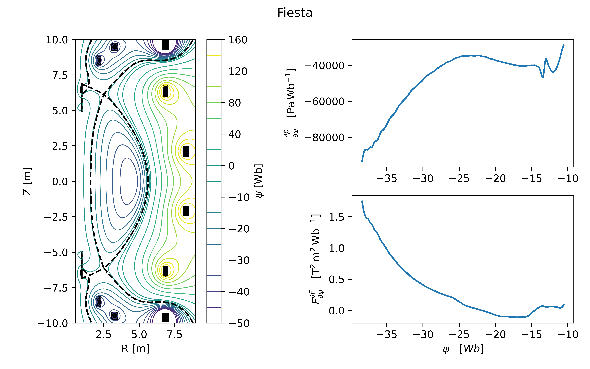
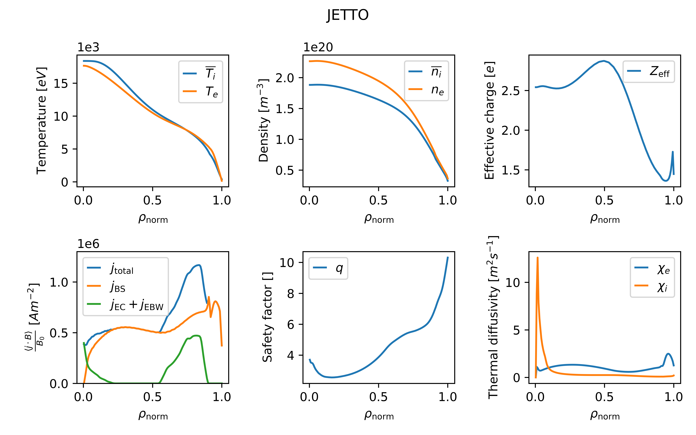

# OpenSTEP

[](https://doi.org/10.14468/07jt-s540)


Welcome to the official public data repository for the [Spherical Tokamak for Energy Production](https://stepfusion.com/).
This repository contains a curated set of data from key physics simulations performed at UKAEA for the STEP Prototype Power Plant, version 1 (SPP-001).

## Overview

[STEP](https://stepfusion.com/) is the UK's ambitious programme to design and build a prototype fusion energy plant, targeting operations in the 2040s.
**This data release is part of UKAEA's commitment to open science, providing the research community with high-quality simulation outputs for exploring reactor-relevant spherical tokamak conditions.**

The data in this repository reflects the STEP design at "concept maturity level 5", which was reached towards the end of 2023.
This design milestone is variously known as SPR45, SPP-001, and CML5.
It does not necessarily reflect the current or future state of the STEP programme.

The data is provided in [IMAS data entries](https://imas-data-dictionary.readthedocs.io/en/latest/) containing IMAS data structures (IDSs).
Two formats are provided: `*/imasdb/*`, entries written with the [IMAS Access Layer](https://imas-core.readthedocs.io/en/latest/user_guide/index.html) using the HDF5 backend, and `*/STEP_SPP_001_*.nc`, NetCDF5 entries readable directly with [IMAS-Python](https://imas-python.readthedocs.io/en/stable/netcdf.html).  Both formats may be read with open source IMAS software components (though the installation and dependencies of the latter are lighter).

## Contents

| Free boundary solution                             | Flat-top operating point                  |
| -------------------------------------------------- | ----------------------------------------- |
|  |  |

Two scenarios are included, one that uses electron Bernstein heating combined with electron cyclotron heating, and one that uses electron cyclotron heating only.
Note that free boundary equilibrium is only available for the EB-CC scenario, which is shown above.

| Scenario             | Description                                                                                                              | IDSs                                                                              | Source | SimDB alias                                                                                                          | SimDB UUID                             |
| -------------------- | ------------------------------------------------------------------------------------------------------------------------ | --------------------------------------------------------------------------------- | ------ | -------------------------------------------------------------------------------------------------------------------- | -------------------------------------- |
| `eb-cc/freeboundary` | Electron cyclotron and electron Bernstein heating, conservative confinement, free boundary equilibrium solve             | `equilibrium` (free boundary), `pf_active`, `wall` (limiter only)                 | [1]    | [`SPP1_CML5_FBE`](https://simdb.step.ukaea.uk/alias/SPP1_CML5_FBE)                                                   | `bee36f40-9891-11f0-9ba9-0cc47a7eec52` |
| `eb-cc/ftop`         | Electron cyclotron and electron Bernstein heating, conservative confinement, full simulation of flat-top operating point | `core_profiles`, `core_sources`, `core_transport`, `equilibrium` (fixed boundary) | [2]    | [`twilson/jetto/step/88888/may3123/seq-2`](https://simdb.step.ukaea.uk/alias/twilson/jetto/step/88888/may3123/seq-2) | `d9d7029a-053f-11ee-99fc-6f3cc269b851` |
| `ec-hd/ftop`         | Electron cyclotron heating only, high density, full simulation of flat-top operating point                               | `core_profiles`, `core_sources`, `core_transport`, `equilibrium` (fixed boundary) | [2]    | [`smars/jetto/step/88888/oct1223/seq-1`](https://simdb.step.ukaea.uk/alias/smars/jetto/step/88888/oct1223/seq-1)     | `77498568-6d9e-11ee-834f-c9a93c9c1edd` |

SimDB aliases and UUIDs are provided for internal provenance tracking.

## Sign conventions and file formats

* IMAS output (Data Dictionary version 3) is [COCOS 11](https://imas-data-dictionary.readthedocs.io/en/latest/cocos.html#cocos)
* Eqdsk output is COCOS 1 (consistent with [original definition](https://w3.pppl.gov/ntcc/TORAY/G_EQDSK.pdf))
* JETTO native output (`jetto.jsp`, `jetto.jst,` etc) is COCOS 2 and may be read into python with [jetto-tools](https://pypi.org/project/jetto-tools/).

## Sources and citing

To cite this release, please use the following:

```bibtex
@misc{brown2025openstep,
author = {Brown, Theodore and Casson, Francis and Hudoba, Agnieszka and Marsden, Stephen and Tholerus, Emmi and Wilson, Thomas and {{The STEP team}}},
title = {OpenSTEP: public data release of the STEP Prototype Powerplant scenario SPP-001},
year = {2025},
publisher = {United Kingdom Atomic Energy Authority (UKAEA)},
note = {Dataset},
doi = {10.14468/07jt-s540},
url = {https://doi.org/10.14468/07jt-s540}
}
```

The original data was published in the following papers:

| Reference | Paper                                                                                                                                              | DOI                                                                  | Code                                                                                                 |
| --------- | -------------------------------------------------------------------------------------------------------------------------------------------------- | -------------------------------------------------------------------- | ---------------------------------------------------------------------------------------------------- |
| [1]       | *Hudoba, A., et al. "Optimisation of the poloidal field system for advanced divertor configurations in STEP." Nuclear Fusion 64.8 (2024): 086055.* | [10.1088/1741-4326/ad53e2](https://doi.org/10.1088/1741-4326/ad53e2) | [Fiesta](https://doi.org/10.1016/j.fusengdes.2013.10.001)                                            |
| [2]       | *Tholerus, E., et al. "Flat-top plasma operational space of the STEP power plant." Nuclear Fusion 64.10 (2024): 106030.*                           | [10.1088/1741-4326/ad6ea2](https://doi.org/10.1088/1741-4326/ad6ea2) | [JINTRAC](https://doi.org/10.1585/pfr.9.3403023), [JETTO](https://inis.iaea.org/records/7h4y6-32977) |

Note that the original simdb entries did not contain IMAS formatted data; this was generated from the original SimDB entries manually.
For the JINTRAC/JETTO IDSs, this meant running a "continue" simulation in JETTO with IDS output enabled starting from the given SimDB case.
For the Fiesta IDSs, this meant using IMAS conversion scripts on Oliver Bardsley's fork of Fiesta.

## License

This repository is licensed under the [Creative Commons Attribution License, version 4](https://creativecommons.org/licenses/by/4.0/).
This means you are free to use and adapt OpenSTEP in any project, as long as you cite it correctly.

## Acknowledgements

Many thanks to Agnieszka Hudoba, Emmi Tholerus and Oliver Bardsley for generating the data and providing help with the open-sourcing process.

This work has been funded by STEP, a UKAEA programme to design and build a prototype fusion energy plant and a path to commercial fusion.

## Contact

Please reach out to [theo.brown@ukaea.uk](mailto:theo.brown@ukaea.uk) and [francis.casson@ukaea.uk](mailto:francis.casson@ukaea.uk) for any enquiries.
